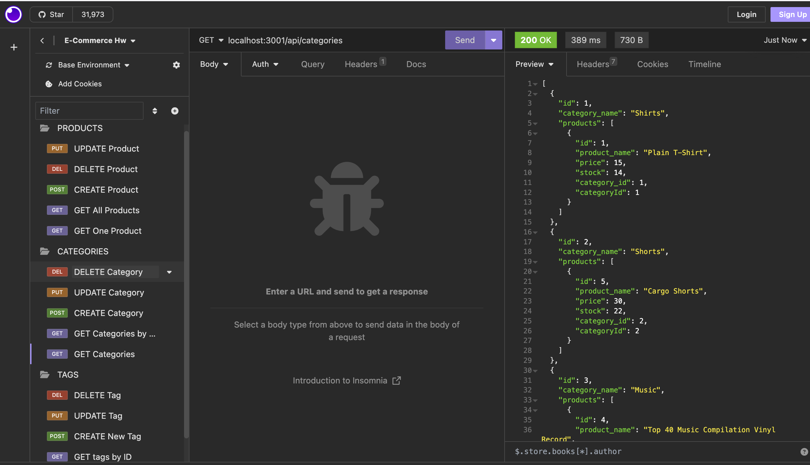

# ORM-E-Commerce-BackEnd-

## Description 
The motivation behind the project was to create a back end application for an e-commerce site so that relevent data (categories, product information, tag, etc) can be handled, viewed and managed properly. This was done using Express. js by connecting a MySQL database using Sequelize. We built this application because it allows users to see seeded data in an efficient way through the back end and then being able to manipulate/play around with that API data in Insomnia once the routes have been established. I learned a lot about creating Models using the Sequelize format, creating API routes (Get, Put, Create, etc), one-to-one and one-to-many relationships, and using Insomnia to perform RESTful CRUD operations. Also created a .env file.

## Installation 

First run: mysql -u root -p to connect to a MySQL database 
Then run: source db/schema.sql
Then create database (ecommerce_db)
Control-D 
Then run: npm run seed to seed your data 
Npm run start to start the application 

## Usage 
Link on how to use the application: https://drive.google.com/file/d/1RVjIP_Ua02_CuEUuOSx1Hqs8Od4FkDAA/view

Instructions for ![InsomniaOperations]: By clicking on the GET, CREATE, UPDATE, and DELETE for corresponding Category, Products, and Tags, you can get, post, update and delete specific data that you have seeded. 

## Credits 
ASKBCS was helpful in resolving some errors 
Tutor assistance 

## License 
Please refer to LICENSE in the Repo

